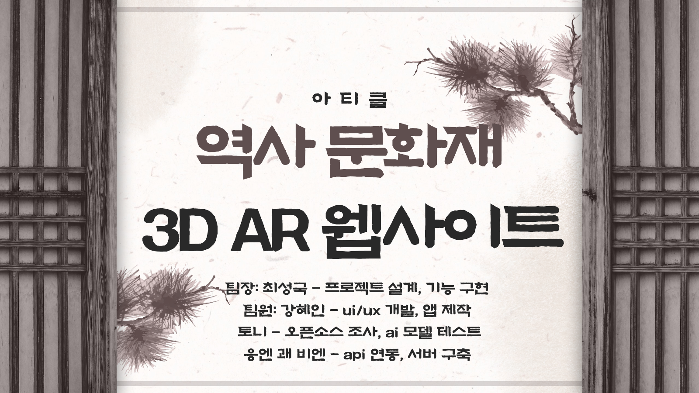

# Article: AI Cultural Heritage 3D & AR Museum

**아티클: AI 기반 문화재 3D/AR 가상 박물관**

**Course / 과목: 캡스톤디자인-01 (Capstone Design-01)**

[English](#english) | [한국어](#한국어) | [Project files / 프로젝트 파일](docs/FILE_INDEX.md)



## English

### Project overview

Article is a team capstone project that explores how a single photograph of a cultural artifact can become a 3D model and an AR museum experience. The team combines image-to-3D generation, a browser-based 3D viewer, mobile AR, and an Android WebView application. The final report also describes cultural-artifact image validation and multilingual AI docent narration.

This portfolio archive is labeled **Capstone Design-01 / 캡스톤디자인-01**. It includes the supplied browser prototype, Android application archive, presentation PDF, and final report.

### My contribution

The final team report records **Tony's role as AI model testing and open-source research**. This repository presents the shared team deliverables and identifies that individual contribution without assigning the entire implementation to one member.

### Features and technologies

| Area | Included material |
| --- | --- |
| Image-to-3D workflow | Image selection, upload, generation progress, Hunyuan 3D through Synexa, and Hitem3D integration in the supplied HTML |
| 3D interaction | Google `<model-viewer>` 3.4.0, camera controls, automatic rotation, GLB viewing and download |
| Mobile AR | Viewer configuration for Scene Viewer, WebXR, and Quick Look |
| Saved work | Browser localStorage history, reload of generated models, and deletion |
| Middleware architecture | Cloudflare Workers upload/proxy endpoints referenced by the browser code; Workers/R2 architecture described in the final report |
| Android deliverable | `app-debug.zip`, containing the original debug APK |
| Broader final system | The report describes Gemini-based cultural-artifact screening, multilingual docent scripts, and text-to-speech narration; the complete backend and native application source are not included in this folder |

### Files to review

| File | Purpose |
| --- | --- |
| [index.html](index.html) | Browser prototype, with API credential values replaced by placeholders |
| [Final report (PPTX)](%5B%EC%A0%95%EB%B3%B4%EB%B3%B4%EC%95%88%ED%95%99%EA%B3%BC%5D%20%EC%A7%80%EC%82%B0%ED%95%99%20%EC%BA%A1%EC%8A%A4%ED%86%A4%20%EC%B5%9C%EC%A2%85%20%EB%B3%B4%EA%B3%A0%EC%84%9C.pptx) | 21-slide team report, architecture, responsibilities, implementation, mentoring, and demonstration |
| [Presentation PDF](article_%EB%B0%9C%ED%91%9C%EC%9E%90%EB%A3%8C.pdf) | 13-page presentation for visual review |
| [Android application archive](app-debug.zip) | Original debug APK package |
| [File manifest](docs/FILE_MANIFEST.csv) | Original and upload SHA-256 checksums, including the HTML sanitization record |

### Local preview and setup

1. Download and extract the repository, or clone it with access to this private repository:

   ```shell
   git clone https://github.com/Tonyssp/article-ar-3d-capstone-01.git
   cd article-ar-3d-capstone-01
   ```

2. Serve the browser prototype from the repository directory:

   ```shell
   python -m http.server 8000 --bind 127.0.0.1
   ```

3. Open `http://localhost:8000/index.html` to inspect the interface and select an image. Internet access is needed for the external viewer module and generation services.
4. Image-to-3D generation needs functioning upload/proxy services and service credentials. This upload uses credential placeholders. Configure authentication on a backend and adapt the client integration before testing generation. The Worker implementation and Android build project are absent from this folder.
5. With the service integration configured, the intended flow is: select an image, choose a generation model, submit the task, inspect the generated GLB, then download it or use AR on a compatible mobile device.
6. The Android archive contains `app-debug.apk`. Review the artifact and rebuild its service configuration before using it as a publicly distributed application.

### Preparation and verification

The PDF, PPTX, and APK archive retain their original bytes. Only the supplied HTML's three credential values were replaced. The original APK still includes legacy embedded service credentials, so this repository remains private. Rotate those credentials and rebuild the APK with backend-managed authentication before public sharing.

Verification covers the artifact inventory, hashes, links, and credential removal from the HTML. No billable AI request, backend deployment, or Android installation was performed during upload. Performance and demonstration results in the presentations belong to the original team report.

## 한국어

### 프로젝트 소개

아티클은 문화재 사진 한 장으로 3D 모델을 생성하고 AR 가상 박물관 경험으로 연결하는 팀 캡스톤 프로젝트입니다. 이미지 기반 3D 생성, 웹 3D 뷰어, 모바일 AR, Android WebView 앱을 결합했습니다. 최종 보고서에는 문화재 이미지 검증과 다국어 AI 도슨트 음성 해설도 기술되어 있습니다.

이 포트폴리오 저장소는 **캡스톤디자인-01**로 표시했습니다. 제공된 웹 프로토타입, Android 앱 압축 파일, 발표 PDF, 최종 보고서를 포함합니다.

### 담당 역할

최종 팀 보고서에 기록된 **토니의 담당 역할은 AI 모델 테스트와 오픈소스 리서치**입니다. 팀 공동 결과물을 보존하면서 개인 기여를 구분하여 설명합니다.

### 기능 및 기술

| 구분 | 포함된 자료의 내용 |
| --- | --- |
| 이미지 기반 3D 생성 | HTML에 이미지 선택·업로드, 진행 상태 표시, Synexa 기반 Hunyuan 3D 및 Hitem3D 연동 코드 포함 |
| 3D 모델 확인 | Google `<model-viewer>` 3.4.0, 카메라 조작, 자동 회전, GLB 조회·다운로드 |
| 모바일 AR | Scene Viewer, WebXR, Quick Look을 위한 뷰어 설정 |
| 작품 기록 | localStorage를 이용한 기록 저장, 모델 불러오기, 삭제 |
| 미들웨어 구조 | 웹 코드의 Cloudflare Workers 업로드·프록시 경로 참조 및 보고서의 Workers/R2 구조 설명 |
| Android 결과물 | 원본 debug APK를 포함한 `app-debug.zip` |
| 최종 시스템 확장 내용 | 보고서에 Gemini 기반 문화재 검증, 다국어 도슨트 대본, TTS 기능 기술. 이 폴더에는 전체 백엔드 및 네이티브 앱 소스가 포함되어 있지 않음 |

### 주요 파일

| 파일 | 용도 |
| --- | --- |
| [index.html](index.html) | API 키를 예시 값으로 변경한 웹 프로토타입 |
| [최종 보고서 (PPTX)](%5B%EC%A0%95%EB%B3%B4%EB%B3%B4%EC%95%88%ED%95%99%EA%B3%BC%5D%20%EC%A7%80%EC%82%B0%ED%95%99%20%EC%BA%A1%EC%8A%A4%ED%86%A4%20%EC%B5%9C%EC%A2%85%20%EB%B3%B4%EA%B3%A0%EC%84%9C.pptx) | 21개 슬라이드의 팀 보고서, 설계, 역할, 구현, 멘토링, 시연 자료 |
| [발표 PDF](article_%EB%B0%9C%ED%91%9C%EC%9E%90%EB%A3%8C.pdf) | 13페이지 발표 자료 |
| [Android 앱 압축 파일](app-debug.zip) | 원본 debug APK 패키지 |
| [파일 체크섬 목록](docs/FILE_MANIFEST.csv) | 원본 및 업로드 SHA-256과 HTML 키 변경 기록 |

### 로컬 미리보기 및 실행 준비

1. 접근 권한이 있는 계정으로 저장소를 다운로드하거나 복제합니다.

   ```shell
   git clone https://github.com/Tonyssp/article-ar-3d-capstone-01.git
   cd article-ar-3d-capstone-01
   ```

2. 저장소 폴더에서 웹 프로토타입을 실행합니다.

   ```shell
   python -m http.server 8000 --bind 127.0.0.1
   ```

3. `http://localhost:8000/index.html`에서 UI를 확인하고 이미지를 선택합니다. 외부 뷰어 모듈과 생성 서비스 사용에는 인터넷 연결이 필요합니다.
4. 3D 생성에는 정상 동작하는 업로드·프록시 서버와 서비스 인증 설정이 필요합니다. 업로드한 HTML은 키 예시 값을 사용합니다. 백엔드에서 인증 정보를 관리하고 클라이언트 연동 코드를 조정한 후 생성 기능을 테스트해야 합니다. Worker 구현 및 Android 빌드 프로젝트는 이 폴더에 없습니다.
5. 서비스 연동 후의 사용 흐름은 이미지 선택, 생성 모델 선택, 작업 제출, GLB 확인, 다운로드 또는 지원 모바일 기기에서 AR 보기입니다.
6. Android 압축 파일에는 `app-debug.apk`가 포함되어 있습니다. 공개 배포용 앱으로 사용하려면 결과물을 검토하고 서비스 인증 설정을 변경하여 다시 빌드해야 합니다.

### 업로드 준비 및 검증

PDF, PPTX, APK 압축 파일은 원본 그대로 보존했고 HTML의 API 인증 값 3개만 예시 값으로 변경했습니다. 원본 APK에는 기존 서비스 인증 정보가 남아 있어 저장소를 비공개로 유지합니다. 공개 공유 전에는 인증 정보를 교체하고 백엔드 인증 구조로 APK를 다시 빌드해야 합니다.

파일 목록, 체크섬, 링크 및 HTML의 인증 값 제거를 확인했습니다. 업로드 과정에서 유료 AI 요청, 백엔드 배포, Android 설치는 수행하지 않았습니다. 발표 자료의 성능 및 시연 결과는 원본 팀 보고서의 내용입니다.
